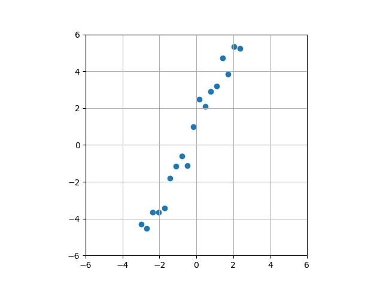
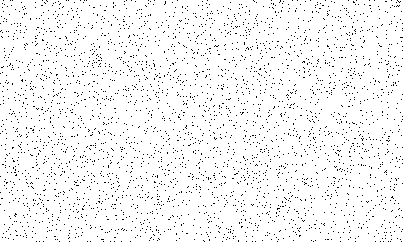
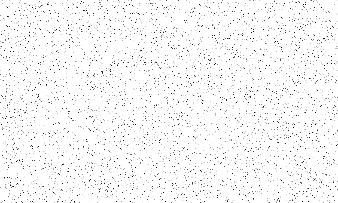
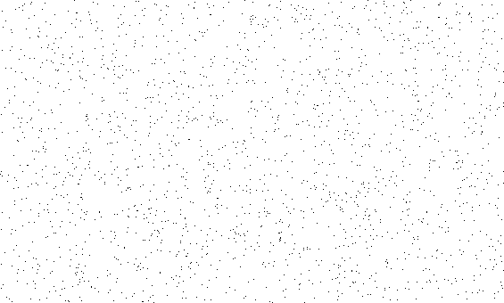

<html>
        <h1>About this project</h1>
        
Simple snippets of Python for ever day use

        <h1>PlotCustomFunction</h1>
        

            This example demonstrates how to plot the results of a custom univariate function.  Example:
        

        

            Consider a function f(x)
            For values of x ranging from x=0 to x=100
            Plot the results of f(x) using Matplot lib
        

        

        <h1>AddNoiseToStraightline</h1>
        

            This example demonstrates how to generate a noisy straight line by adding Gaussian noise (np.random.normal) to the results of the equation y=mx+c
        

        
        

        <h1>SaltAndPepperNoise</h1>
        

            Demonstrates how to generate Salt and Pepper noise using scikit-image module
        

        <h2>salt_vs_pepper=0.2</h2>
        

        <h2>salt_vs_pepper=0.5</h2>
        

        <h2>salt_vs_pepper=0.8</h2>
        
        

</html>

    

