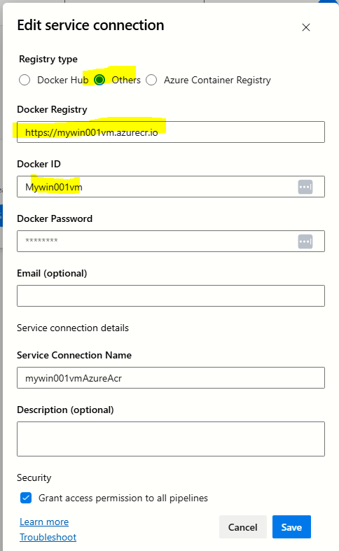
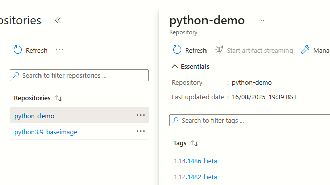

[[_TOC_]]

# Objective
Experiment building docker images with Python using base Windows operating system.

# How does it work ?
- Take a base windows image (e.g. `mcr.microsoft.com/windows/servercore:ltsc2019`)
- Download the required vesion of Python
- Install Python

---

# Where can we find all the versions of Python ?
The base URL for downloading is here https://www.python.org/ftp/python/. You will need to insert the version in the URL.
However, not all versions have the Windows installer. Refer this link for a [summary of all versions](https://www.python.org/downloads/windows/) on Windows.

---

# Does Docker hub provide ready made Windows images with Python ?
Yes.  Refer this [Github link](https://github.com/docker-library/python/blob/master/3.13/windows/windowsservercore-ltsc2025/Dockerfile) for a Dockerfile with Python 3.14 on windowsservercore


---

# What do we learn?

- Not all Python versions are available on Windows
- There are indeed Windows docker images with Python installed. But, only some of the vesions are installed
- You will need to verify the SHA signaure using PowerShell script. Refer sample from Github of Docker (link below)
- The YAML property `vmImage` will influence which version of Windows base image to pull. Example: with  `windows-2019` you can use `mcr.microsoft.com/windows/servercore:ltsc2019` base image
- Windows **Nanoserver** image does not have **PowerShell**
- The concept of tagging an image as `latest` is purely conventional. This is not determined automatically. Any image could be tagged as `latest` - you will need to do it when publishing the pipeline

---

# What remains to be learnt/done ?

1. Use the Windows Nano Server image for a lighter installation of Python (requires PowerShell, see probable [Dockerfile snippet](docs/installpowershell.md))

# How to create a Dockerfile with the desired version of Python?

See the Dockerfile on Github link of Docker Hub in the references

---

# Windows docker images

## All configurations

1. Windows Nano Server
1. Windows Sever Core
1. Windows
1. Windows Server
https://learn.microsoft.com/en-us/virtualization/windowscontainers/manage-containers/container-base-images

## Windows Nano server
https://hub.docker.com/r/microsoft/windows-nanoserver


---

# How to push images from Azure Devops to Azure Container Registry ?

## Setting up a connection with Azure Container Registry for pushing images?


## YAML pipeline

### Essential variables
You need the following variables:
```yml
variables:
  containerRegistry: "mywin001vm.azurecr.io"  # Replace with your registry URL from Azure portal
  repositoryName: "python-demo"
  dockerRegistryServiceConnection: "mywin001vmAzureAcr"  # Replace with your service connection name (seep picture of how to configure a Service connection)
```

### Docker build and push

```yml
        steps:
          - task: Docker@2
            displayName: "Build and push Docker image"
            inputs:
              command: "buildAndPush"
              dockerfile: "$(workingDirectory)/Dockerfile"
              buildContext: "$(workingDirectory)"
              repository: "$(repositoryName)"
              tags: $(imagetag)
              containerRegistry: "$(dockerRegistryServiceConnection)"
```

## Output on Azure Container Registry



---

# Misc/References

## Steps for pushing an image to a private repo

https://stackoverflow.com/a/45312996/2989655


## Verify a downloaded file using ASC 
Need more information.
https://crypto.stackexchange.com/questions/43537/verifying-a-downloaded-file-with-an-asc-file


## Official Github site for Windows docker images

https://github.com/docker-library/python/blob/master/3.13/windows/windowsservercore-ltsc2025/Dockerfile

We can see the Dockerfile contents here for various versions of Python. 
Note - I see a Windows folder for the following versions of Python only:
1. 3.13
1. 3.14-rc

## Docker hub tags with Python and Windows
https://hub.docker.com/r/winamd64/python/tags
and this
https://hub.docker.com/_/python
The latter looks more authorative. You will find images tagged with `windowsservercore`


---

# Building using Azure Container Registry

## What was the Azure CLI command ?

This assumes that the current working directory contains the docker file `DockerfilePythonBase`

```
az acr build --platform windows --registry mywin001vm --image viacmdline/sample:1.0 --file DockerfilePythonBase .
```

## How long did it take on first attemp ?
7 minutes


## Does caching improve the subsequent build time ?
Need to try this

## Restructuring into 3 separate folders/pipelines (WORK IN PROGRESS)
Make this into a mono-repo. 3 repos
- One using standard Docker build and push a base Python image to ACR
- Second using Azure ACR for build and push a base Python image. How long does it take?
- Third one which uses Docker to build and push a custom Python built on the base Python image. How long does it take?

1. 3 folders
    1. base-python-image(BASE)
    1. custom-python-app-acr-build
    1. custom-python-app-docker-build
1. Each folder with its own CI/CD pipeline
1. Create 3 skeletal Azure pipelines in Azure Devops

---

# Understanding the folder structure

The objective was to build a base Python image and then re-use this image to build a custom Python app image. The custom Python app image has been build using 2 approaches
1. Traditional Docker build
2. Offloading the build to Azure ACR via CLI

## base-python-image
In this folder we are 
1. building a base Python image
2. pushing the image to Azure container registry

## custom-python-app-image-acr-build
TO BE DONE

## custom-python-app-image-docker-build
TO BE DONE
