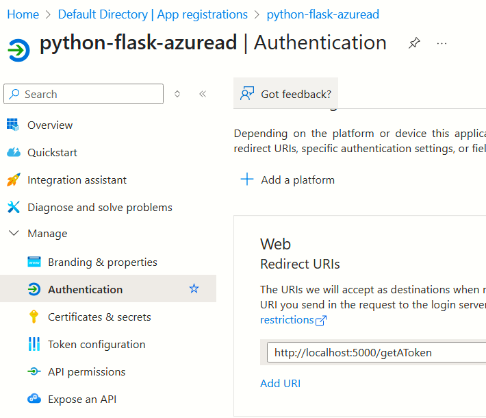
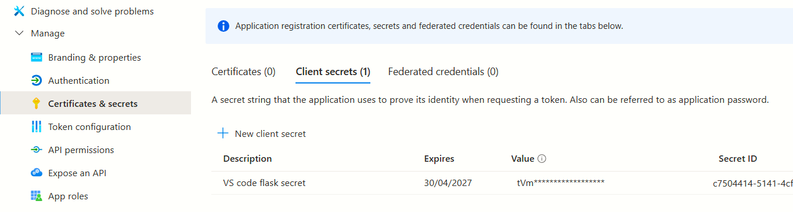
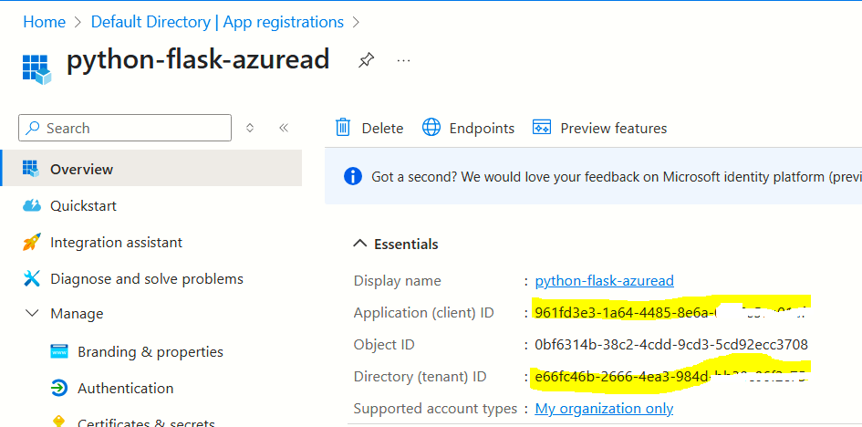

[[_TOC_]]

# About
Demonstrates Azure AD integration with Python Flask

---

# Next steps
1. Secure Plotly-Dash multi pages
1. Persist session in file
1. Configure AD app registration for claims

----

# Approach for authenticating Dash pages

## Intro
We have a simple Dash multi-page ???(link comes here) application.

## Challenge
For regular Flask view, We would have used `login_required` decorated to protect the route.

```python
@app.route("/secureview")
@login_required
def secure_view():
    pass
```
But, the above is not applicable for Dash pages

## Possible approach

## Step-1-Intercept all requests in a before_request handler

```python
def before_app_request():
    current_path = request.path
    current_url = request.url
    logging.info(f"Before request: Path = {current_path}, URL = {current_url}")

```

## Step-2-Check if this is a Dash page

if one of the Dash pages, then re-route to login
```python
@app.before_request
def before_app_request():
    current_path = request.path
    current_url = request.url
    logging.info(f"Before request: Path = {current_path}, URL = {current_url}")
    if not current_path.startswith("/dash/"):
        return
    if not session.get("user"):
        logging.info("User not authenticated, redirecting to login")
        return redirect(url_for("login"))
    else:
        logging.info(f"User authenticated: {session['user']['name']}")

```

----

# Summary steps from copilot for integrating AD authentication with Flask
[Steps from Copilot](docs/copilot.md)

----

# How does login_manger work ?

## Step-0-Configure login_manager
You need to specify the route which will do the login operation

## Step-1-Handle getAToken end point

This method receives the JWT token. Decode the `email` and `name` attributes from the token and invoke the method `login_user` 

## Step-1-user_loader method to intercept all calls

This will create an `User` object by reading `email` and `name` from `session`

## Step-3-Protect the views using `@login_required`

- This will kick off the login sequence whenever somebody tries to hit the protected route. 
- The login route specified while configuring `login_manager` will be invoked

---

# App registration on Azure AD

## Redirect URL


## Client Secret



## Client ID and Tenant ID



---

# Configuring Flask session

## File system 
https://stackoverflow.com/questions/53841909/clean-server-side-session-files-flask-session-using-filesystem

```python
# __init__.py

from flask_session import Session
from datetime import timedelta

app.config['SESSION_PERMANENT'] = True
app.config['SESSION_TYPE'] = 'filesystem'
app.config['PERMANENT_SESSION_LIFETIME'] = timedelta(hours=5)

# The maximum number of items the session stores 
# before it starts deleting some, default 500
app.config['SESSION_FILE_THRESHOLD'] = 100  
app.config['SECRET_KEY'] = config.SECRET_KEY
app.config['SESSION_FILE_DIR'] = '/path/to/session/folder'  # Specify your folder path here
sess = Session()
sess.init_app(app)
```

