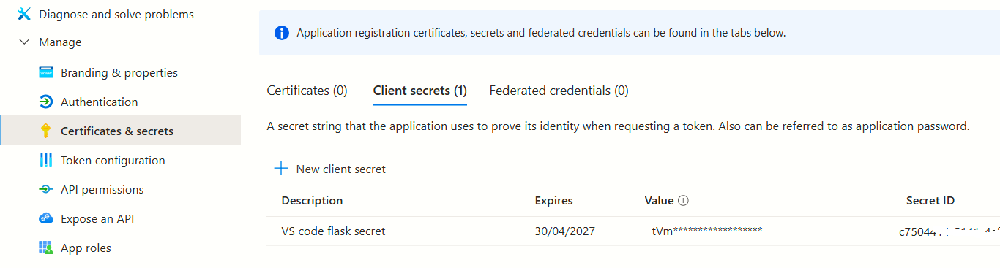

[[_TOC_]]

# About
Demonstrates Azure AD integration with Python Flask

---
# Next steps
1. Use a mix of authenticated and non-authenticated pages
1. Control the session time out / cookie expiration time out
1. Login/logout link - display logged in user name

----

# App registration

## Redirect URL


## Client Secret



## Client ID and Tenant ID


---

# Configuring Flask session

## File system 
https://stackoverflow.com/questions/53841909/clean-server-side-session-files-flask-session-using-filesystem

```python
# __init__.py

from flask_session import Session
from datetime import timedelta

app.config['SESSION_PERMANENT'] = True
app.config['SESSION_TYPE'] = 'filesystem'
app.config['PERMANENT_SESSION_LIFETIME'] = timedelta(hours=5)

# The maximum number of items the session stores 
# before it starts deleting some, default 500
app.config['SESSION_FILE_THRESHOLD'] = 100  
app.config['SECRET_KEY'] = config.SECRET_KEY
app.config['SESSION_FILE_DIR'] = '/path/to/session/folder'  # Specify your folder path here
sess = Session()
sess.init_app(app)
```

