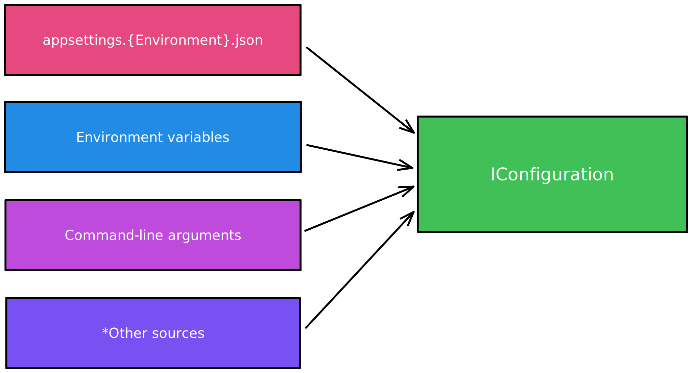
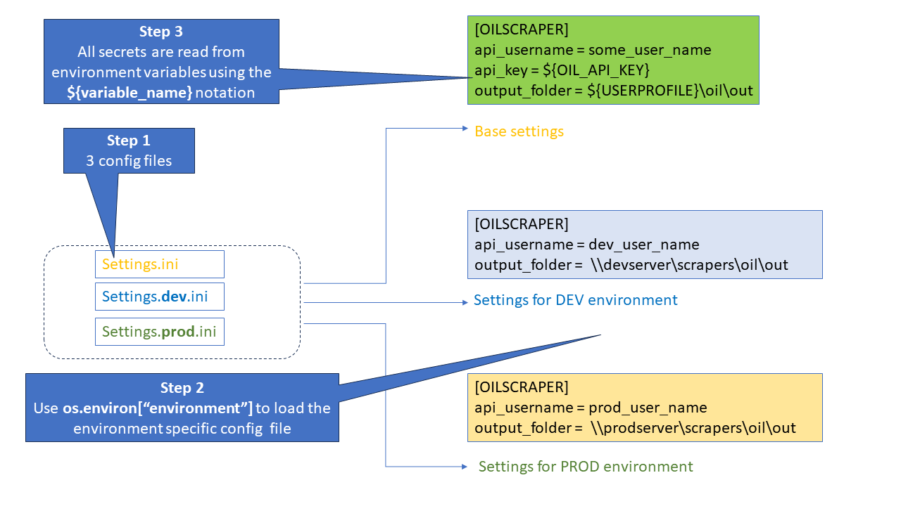
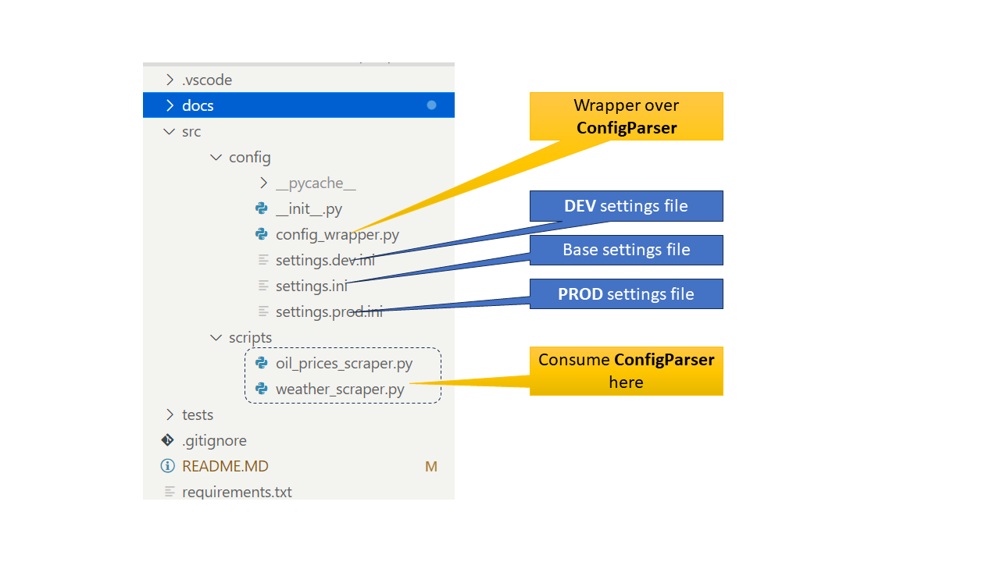
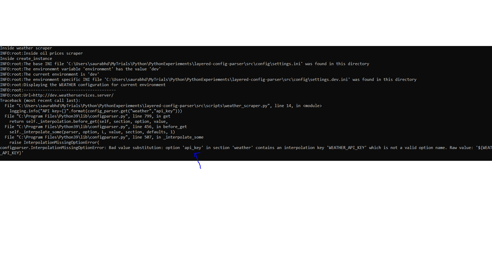

[[_TOC_]]

# Layered configuration in Python - ConfigParser is all you need

# Overview
This short article demonstrates the usage of Python's out of box `ConfigParser` class to implement a layered system of configuration using mulitple config files and seamlessly redirecting the config entries to be read from an environment variable. We will demonstrate how such a system can make your Python code to dynamically adapt to any environment.


---

# Inspiration for this article

After having worked with `.NET Framework` and now with `.NET Core`, I was inspired to investigate if `Python` had anything, which was similar to the solution offered by [.NET Core's layered Configuration](https://learn.microsoft.com/en-us/dotnet/core/extensions/configuration) approach. This system revolves around the `IConfiguration` abstraction.



---

# What is the problem we are trying to solve ?

Lets imagine a classic scenario of Python code used for scraping information from various data sources. You have a **DEV** environment where you test your code (_more than often this would be the environment where your feature branch gets deployed via CI/CD_) and a **PROD** environment which is more stable and producing data fit for consumption (_you would probably deploy your master-main branch here_).

 You want to write your code in a manner which makes it possible for it be deployed to `DEV/UAT/PROD` environments and on `Docker/VM` hosts.

Here are some of the common anti-patterns that we want to avoid:

#### Hard coded secrets
```python

def hardcoded_secrets():
    secret="Pass@!*(34"
    invoke_rest_endpoint(apikey=secret)

```

#### Hard coded operating parameters

```python
dev_output_folder="\\dev.server.com\out"
prod_output_folder="\\prod.server.com\out"

def hardcoded_parameters():
    generate_data_files(output=dev_output_folder)

```

#### Nasty if-else to switch between environments

```python
dev_output_folder="\\dev.server.com\out"
prod_output_folder="\\prod.server.com\out"


def genreate_some_reports():
    if (sys.argv[1] == "dev"):
        generate_data_files(output=dev_output_folder)
    else:
        generate_data_files(output=prod_output_folder)

```


---
# What does the final solution look like?




```python

# Create an instance of ConfigParser
config_parser = configparser.ConfigParser(os.environ,interpolation=configparser.ExtendedInterpolation())

# Read the base settings
config_parser.read("basesettings.ini")

# Read the environment specific settings
environment = os.environ["environment"]
config_parser.read(f"settings.{environment}.ini")

# All set!
# Read the config values
api_username = config_parse["oil"]["api_username"]
api_key = config_parse["oil"]["api_key"]

```

---


# Putting it all together



#### Sample client code

```python
import sys
import logging
from src.config import ConfigWrapper


if __name__ =="__main__":
    logging.basicConfig(level=logging.INFO)
    logging.info("Inside oil prices scraper")
    config_parser = ConfigWrapper.create_instance()
    logging.info("Displaying the OIL configuration for current environment")
    logging.info("---------------------------------------")
    logging.info("Url={}".format(config_parser.get("oil","endpoint")))
    logging.info("API key={}".format(config_parser.get("oil","api_key")))
    logging.info("Output folder={}".format(config_parser.get("oil","output_folder")))
```

---

# Accompanying code

#### Link to repo

https://github.com/sdg002/PythonExperiements/tree/master/layered-config-parser


### Running the code
Instructions for Windows below. 

1. Clone the repo
1. Launch a CMD
1. Navigate to the sub-folder `layered-config-parser`
1. Set the environment variable `PYTHONPATH` to the absolute path to the sub-folder `layered-config-parser`
1. Set the environment variable `ENVIRONMENT` to `prod`
1. Run `python src\scripts\weather_scraper.py`



Python is complaining about the missing environment variable `WEATHER_API_KEY`. We are referencing  `WEATHER_API_KEY` via the line `api_key=${WEATHER_API_KEY}` in the file `settings.ini` . 

Set the environment variable `WEATHER_API_KEY` to some value and run again


Voila!

---

# References 

- [Python ConfigParser reference](https://docs.python.org/3/library/configparser.html)
- [Extended interpolation not working in ConfigParser](https://stackoverflow.com/a/42841091/2989655)

---
