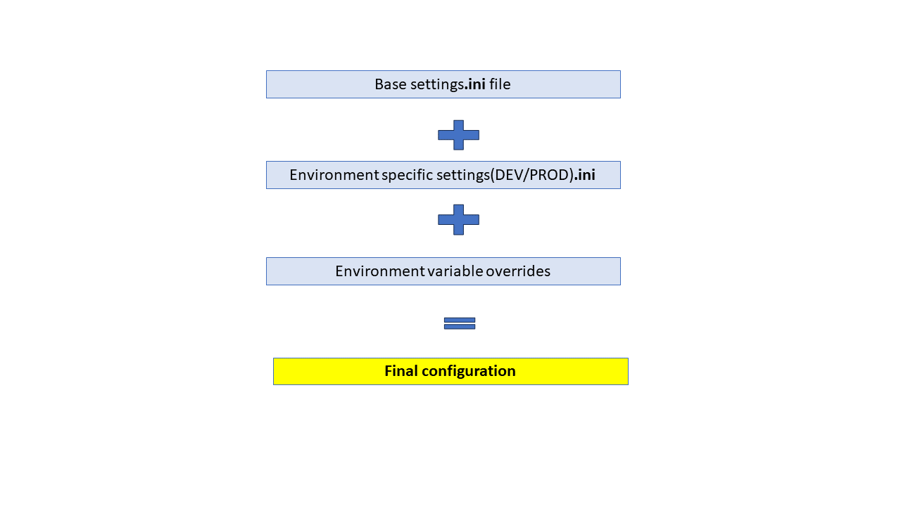

[[_TOC_]]

# Overview
Demonstrates the usage of Python's out of box `ConfigParser` class to implement a layered system of configuration using mulitple config files and seamlessly redirecting the config entries to be read from an environment variable. We will demonstrate how such a system can make your Python code to dynamically adapt to any environment.

---

# What is the problem we are trying to solve ?

Lets imagine a classic scenario of Python code used for scraping information from various data sources. You have a **DEV** environment where you test your code (could be the feature branch) and a **PROD** environment which is more stable and producing data fit for consumption.

 You want to write your code in a manner which makes it possible for it be deployed to DEV/UAT/PROD environments and on Docker/VM hosts

1. How can we manage settings across DEV, PROD and other environments without having to change Python code?
1. How can we avoid hard coding confidential settings in Python or config files ?

---
# What does the final solution look like (to be done)?

---

# Solution using the out of box ConfigParser (to be done)

[show a simple snippet]

---

# Layered configuration

---

# Accompanying code
to be done ??

---

# References 
- to be done ??

#  Where was I ?
- Show code snippets
- 