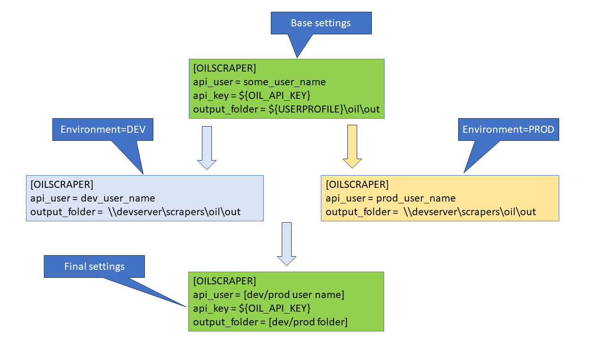

# Overview
Demonstrates the usage of Python's out of box ConfigParser class to implement a layered system of configuration using mulitple config files

# What is the problem we are trying to solve ?

1. How can we manage settings across DEV, PROD and other environments without having to change Python code?
1. How can we avoid hard coding confidential settings in Python or config files ?

---

# Solution using the out of box ConfigParser

[show a simple snippet]

---

# Layered configuration

---

